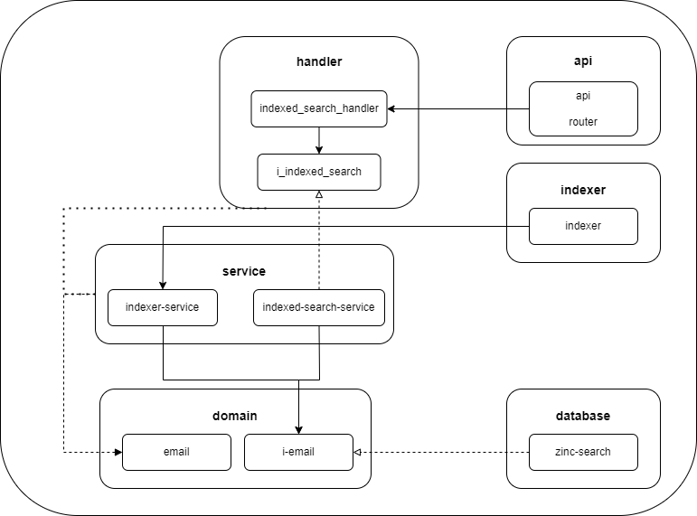

# Api project



## Initial configuration
- Download and install the search engine [ZincSearch]([https://docs.zinc.dev/installation/](https://openobserve.ai/docs/quickstart/#self-hosted-installation))
- Download the [database](http://www.cs.cmu.edu/~enron/enron_mail_20110402.tgz) where Enron Corp emails are located

- The main file to run the project is located in 'mail_search/backend/cmd'.
```sh
cd mail_search/backend/cmd
```

- To install the dependencies.
```sh
go mod tidy
```

- Run open observe. Set 'ZINC_FIRST_ADMIN_USER' and 'ZINC_FIRST_ADMIN_PASSWORD' variables.
```sh
set ZO_ROOT_USER_EMAIL=root@example.com
set ZO_ROOT_USER_PASSWORD=Complexpass#123
openobserve.exe
```

- And finally
```sh
go run main.go
```

## Profiling
- To do the profiling run the main file with the following command.
```sh
go run main.go -cpuprofile=cpu.prof
```

- To see the reesult of the profiling.
```sh
go tool pprof -http=:8080 cpu
```
